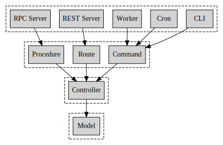

# barebone-js

barebone-js is a backend boilerplate for Node.js and TypeScript.

## Features

- TypeScript
- Graceful kill
- Stacked configurations
- Extensible application context
- Well-organized project structure
- Almost zero learning curve


## Ideal Architecture



## config/

Configs are stacked, from bottom to top:

- config.default.yaml
- config.\<_environment_\>.yaml
- config.local.yaml

All these configs will be merged into a single config object during the bootstrap process.

In practice, the default and environment specific configs are supposed to store generic insensitive settings like URL and port. While the local config is supposed to store variable and sensitive settings like tokens and passwords, it only shows up locally or in a deployment, it should never be committed into repository or built into image. For kubernetes deployments, we suggest use [volumes](https://kubernetes.io/docs/concepts/storage/volumes/) to mount local config into container.

Available \<_environment_\> are:

- ci: for continuous integration environment
- development: for development environment
- test: for test environment
- staging: for staging environment
- production: for production environment

## src/

```
├── applications
├── commands
├── context
├── controllers
├── libraries
├── migrations
├── models
├── providers
├── routes
└── types
```

